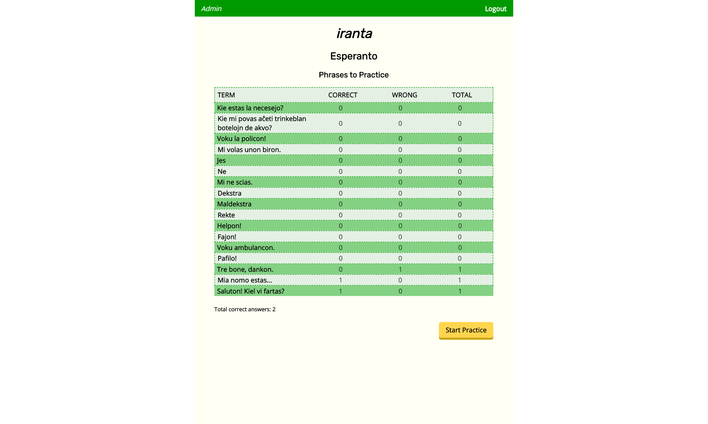
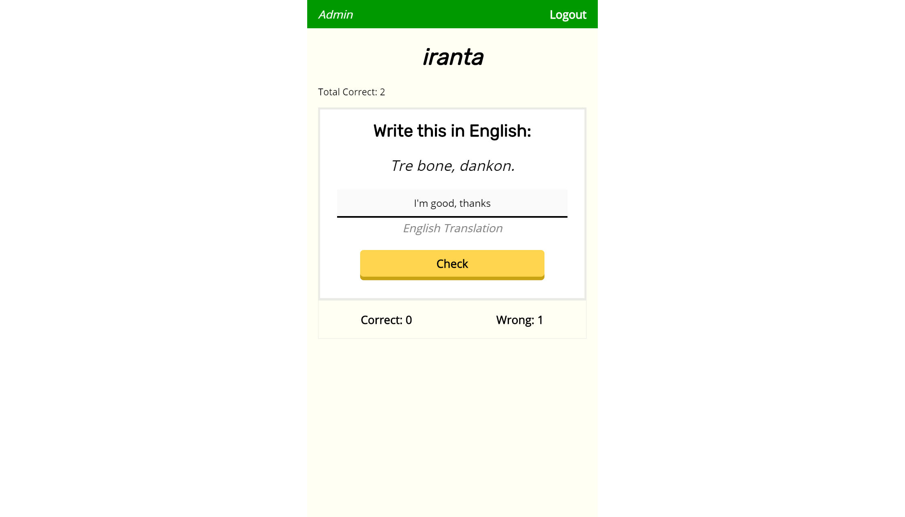

# Iranta - Client

This is the client code repository for Iranta, a full stack web app by **Kevin Wei** & **Phoebe Law** for learning Esperanto through the spaced repetition algorithm.

- [Link to Live App](https://iranta.now.sh/)
- [Link to Server Repo](https://github.com/thinkful-ei-gecko/phoebe-kevin-esperanto-server)

## Summary

Iranta is a language learning app that focuses on Esperanto words and phrases. Users will expand their Esperanto vocabulary by submitting guesses for words one-by-one in flashcard form. The words are presented in a deterministic order based on how many correct and wrong answers the user has previously submitted for the word. This learning methodology is known as _spaced repetition_ and is scientifically proven to improve memory retention.

#### Desktop View

---

#### Tablet View

---

#### Mobile View

## Technology Stack

### Frontend

- **React** + **React Router**, **HTML5**, **CSS3** for client-side view
- **Cypress** for end-to-end testing

### Backend

- **Express** for handling API requests
- **Knex.js** for interfacing with the **PostgreSQL** database
- **Postgrator** for database migration
- **Mocha**, **Chai**, **Supertest** for endpoints testing
- **JSON Web Token**, **bcryptjs** for user authentication / authorization
